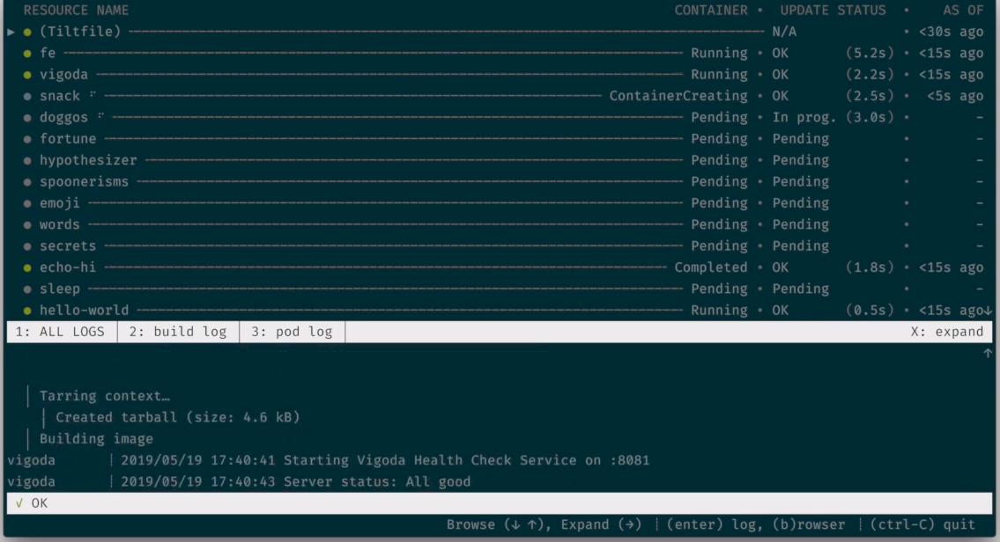
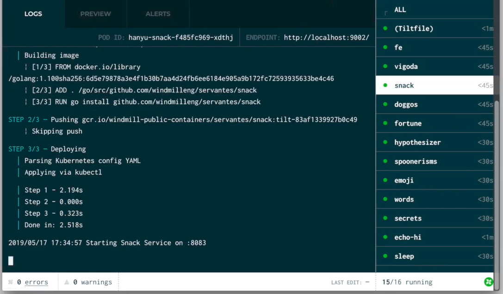
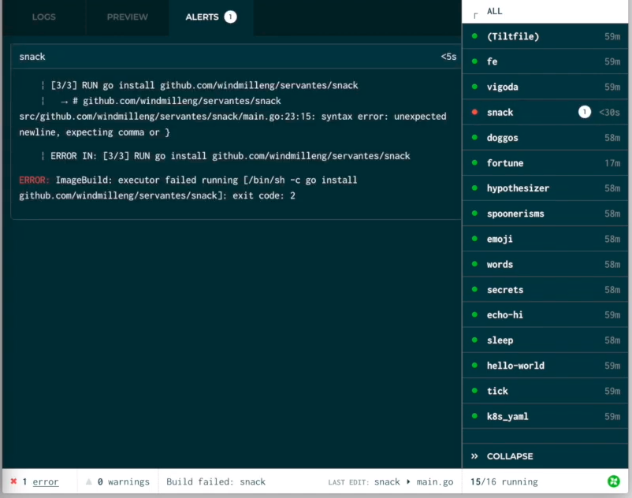
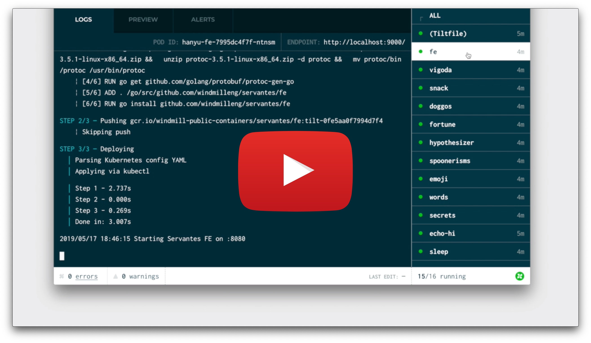

# Welcome to Tilt

**Tilt gives you a powerful microservice dev environment that seamlessly bridges the gap between local and Kubernetes.**

Think `docker build && kubectl apply` or `docker-compose up`.

## What does it do?

- Watch your files for edits

- Applies changes automatically & builds your container images in real-time

- Makes your builds way faster

- Combines all of the debug information into one clean, efficient interface

- No guessing games with kubectl ever again

The engineer who sent you to this page has already configured Tilt for your project. You can get started right now!

## Installing

The quick install downloads the Tilt command-line tool.

<pre style="user-select:all"><code>curl -fsSL https://raw.githubusercontent.com/windmilleng/tilt/master/scripts/install.sh | bash</code></pre>

[ [More options in the docs](https://docs.tilt.dev/install) ]

## Getting Started

All you need to do is go to any project with a `Tiltfile` and `tilt up`:

<pre style="user-select:all"><code>tilt up</code></pre>

[ [To learn more about how Tilt works check out our friendly docs.](https://docs.tilt.dev) ]

## Hack, Observe, Repeat

Now that you have run `tilt up`, you can:

### Keep an eye on build and health status as you code

### Browse logs by server to understand what's happening

### Spot errors when something goes wrong

### [Watch the Demo](https://www.youtube.com/watch?v=oSljj0zHd7U)

## Back to getting things done

This README is for application engineers who have been sent here after Tilt was
set up in your project.

Don’t have your project configured yet? 

[ [Read how here](https://docs.tilt.dev/tutorial.html) ]

To add project-specific instructions for your other contributors,
just fork this repo and edit this guide!

### License

Licensed under [the Apache License, Version 2.0](LICENSE)

